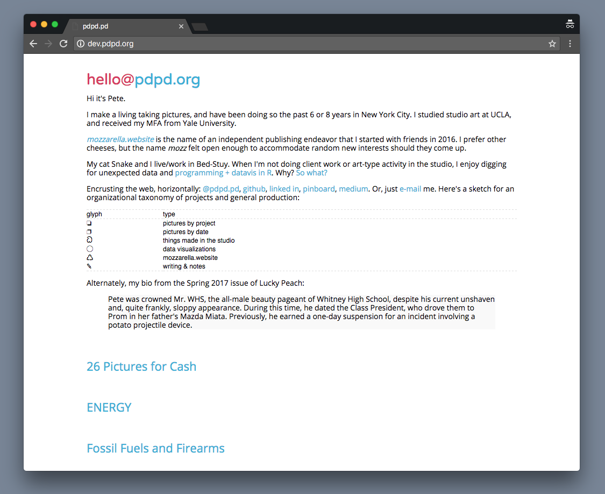

# welcome to my web site
  
This is the code for my portfolio website. For many years this website has housed my photography work for clients and people in general to see. 

I've been editing the `index.md`  and `style.css` files a lot lately to accommodate my growing interests in datasci, programming, and visualization in R - hence, pushing to GitHub for version control.

Since 2016 the CMS in use has been [sassolino](https://github.com/pwrstudio/sassolino) - a nice lightweight, static flatfile.
  
 

## goals

There are 3 primary objectives to this website:

- showcase photography work 
- introduce data analysis and visualization work
- showcase independent publishing work

A subgoal in _showcasing work_ might be showing a bit of  _personality_, in order to win favor from potential clients or backers. 

## to-do
 
 - preview image size on main index page - make smaller or eliminate? can this be done in the `index.php` file? **just add thumbnail-sized image in each directory to appear on index page.** approx 400-600px wide.
 - ~~consider linking pictures to separate full archive page.~~
 - complete a better [taxonomy-based glyph design](https://ai2-s2-pdfs.s3.amazonaws.com/9f8f/ef6db6b012c227d79d185fec1ab21461d71b.pdf) for organizing projects. Why? This provides an opportunity to hopefully uncover latent connections between projects.
 - finish some damn projects
 
Here's a sketch for an organizational taxonomy of projects and general production:

| glyph  | type                     |
| ------ | -------------------------|
|        |                          |
| ❏      | pictures by project      |   
| ❐      | pictures by date         |
| ධ      | things made in the studio |
| ◯      | data visualizations      |
| ♺      | mozzarella.website       |  
| ✎      | writing & notes          |